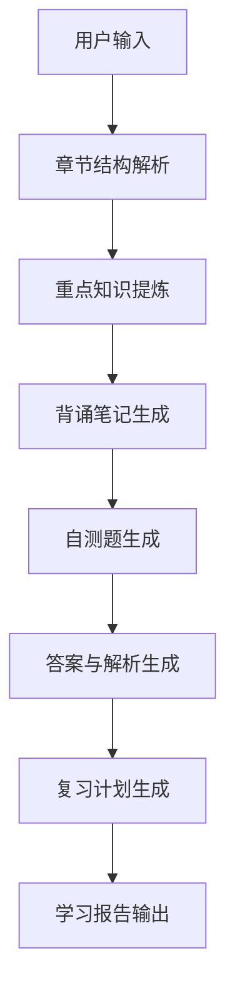
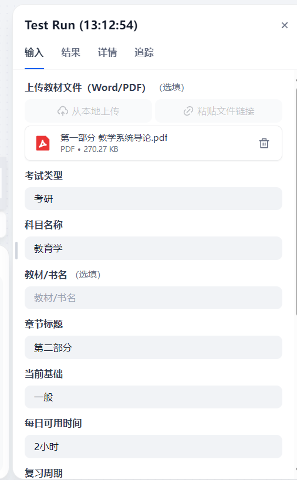
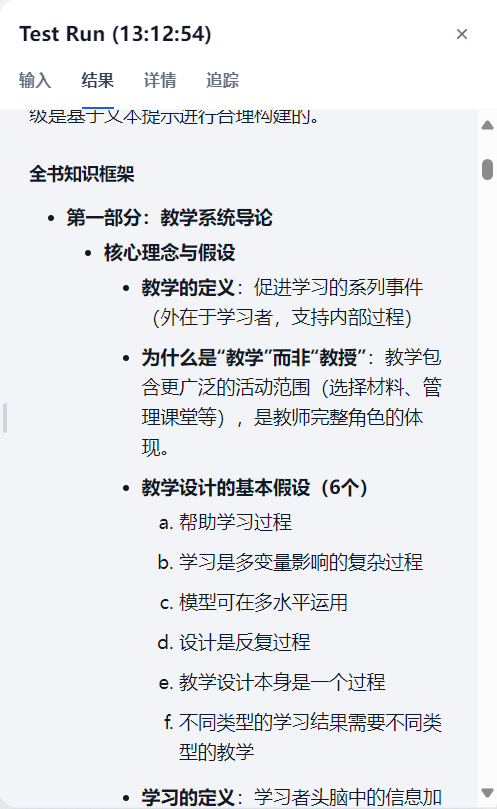
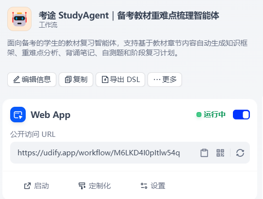

# 考途 StudyAgent

基于 Dify Workflow 的备考教材重点梳理与个性化复习智能体。

## 项目简介

考途 StudyAgent 面向考研、考公、职业资格考试及大学课程复习场景，帮助用户将教材章节内容转化为可复习、可背诵、可自测、可执行的学习报告。

用户输入科目、考试类型、教材章节内容、当前基础、每日可用时间和复习周期后，系统会输出：

- 章节结构解析
- 重点知识提炼
- 背诵笔记
- 自测题
- 答案与解析
- 个性化复习计划

## 为什么做这个项目

教材型考试复习中，学生常见问题不是“没有资料”，而是资料太多、重点不清、笔记整理效率低、复习计划不可执行。StudyAgent 尝试用 AI Workflow 将复习链路拆解为多个稳定节点，让生成结果更结构化、更可解释。

## AI Workflow




## 项目结构

```text
studyagent-dify/
├── README.md
├── LICENSE
├── .gitignore
├── dify/
│   ├── studyagent-workflow.yml
│   └── workflow-guide.md
├── docs/
│   ├── PRD.md
│   ├── user-research.md
│   ├── competitor-analysis.md
│   ├── ai-workflow-design.md
│   ├── prompt-design.md
│   ├── test-report.md
│   ├── iteration-log.md
│   └── interview-script.md
├── prompts/
│   ├── 01-chapter-structure.md
│   ├── 02-key-points.md
│   ├── 03-memorization-notes.md
│   ├── 04-quiz-generation.md
│   ├── 05-answer-explanation.md
│   └── 06-study-plan.md
├── portfolio/
│   └── notion-content.md
└── resume/
    ├── resume-project-description-cn.md
    └── resume-project-description-en.md
```

## 当前状态

- 已完成 Dify Workflow 原型搭建。
- 已完成多节点学习报告生成流程。
- 已完成真实 PDF 上传测试，能够基于教材材料生成章节框架与复习内容。
- 已补充最新 Dify DSL。
- 已补充 Workflow、输入示例、输出示例和发布页面截图。
- 待补充：更多教材测试记录和作品集链接。
- 对扫描版 PDF 的处理仍处于迭代阶段，当前建议先 OCR 成可复制文本后再上传或粘贴。
- Word 文档导出作为进阶能力设计，当前建议先输出结构化 Markdown 报告，后续接入 Word 导出工具。

## Demo 与作品集

- Demo：https://udify.app/workflow/Ml6LKD4l0pltIw54q
- Notion 作品集：待补充
- Dify DSL：见 `dify/studyagent-workflow.yml`

## 产品截图

### 输入示例



### 输出示例



### 发布页面



## 安全说明

本仓库不包含任何 API Key、Token、密码、私人账号信息或真实用户隐私数据。

## 扫描版资料说明

扫描版 PDF 本质上是图片，Dify 文档提取节点可能无法稳定识别。当前 MVP 阶段建议先使用 OCR 工具将扫描版资料转为可复制文本，再按章节输入。详细方案见 `docs/ocr-strategy.md`。

## Word 输出说明

最终学习报告建议先使用 Markdown 格式稳定排版。若要直接生成 `.docx` 文件，可在 Workflow 末尾增加 Template 节点和 Word 导出工具节点。详细方案见 `docs/word-export-design.md`。
