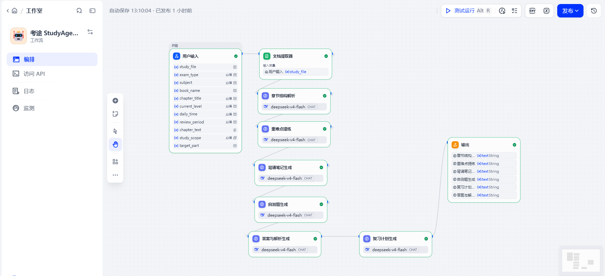
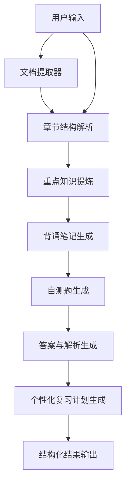

# 考途 StudyAgent

> 基于 Dify Workflow 的备考教材重点梳理与个性化复习智能体，面向考研、考公、教资、法考、职业资格考试和大学课程复习场景。

**关键词：** AI Product / Dify Workflow / Prompt Engineering / 结构化内容生成 / 个性化复习计划 / 可导入 DSL

- 产品定位：将教材章节或学习材料转化为结构化复习报告
- 核心能力：章节解析、重点提炼、背诵笔记、自测题、答案解析、复习计划
- 技术实现：Dify Workflow 多节点编排 + Prompt Engineering
- 可复用交付：提供可导入的 Dify DSL 文件
- Demo：<https://udify.app/workflow/Ml6LKD4l0pltIw54q>

## 产品预览


### Workflow



### 输入示例


### 输出示例


## 项目背景

备考类学习者常常需要处理篇幅较长、结构复杂的教材或讲义。传统方式需要人工阅读、划重点、整理笔记、做题和安排复习计划，过程耗时且容易割裂。通用大模型虽然可以总结内容，但如果缺少固定流程和输出规范，结果往往结构不稳定、重点不清、难以直接执行。

考途 StudyAgent 尝试用 Dify Workflow 将教材复习拆成多个 AI 节点，让输入材料依次经过章节结构解析、重点知识提炼、背诵笔记生成、自测题生成、答案与解析生成和个性化复习计划生成，最终输出一份可用于复习的结构化报告。

## 用户痛点

1. 教材内容篇幅长，人工整理效率低。
2. 用户难以快速识别章节结构和考试重点。
3. 笔记、练习题和复习计划相互割裂。
4. 通用大模型输出缺乏稳定结构。
5. 用户难以把教材内容转化为可执行的复习任务。

## 产品解决方案

StudyAgent 将学习任务拆成可控的 Workflow：

```text
用户输入教材章节或学习材料
→ 章节结构解析
→ 重点知识提炼
→ 背诵笔记生成
→ 自测题生成
→ 答案与解析生成
→ 个性化复习计划生成
→ 结构化结果输出
```

最终结果包含：

- 章节结构
- 核心重点
- 背诵笔记
- 自测题
- 答案与解析
- 复习计划

## 核心功能

| 功能 | 说明 |
|---|---|
| 教材输入 | 支持用户输入或上传教材章节、学习材料 |
| 章节结构解析 | 识别章节层级、主题、知识模块和概念关系 |
| 重点知识提炼 | 区分必背、理解、易混淆和可能考查内容 |
| 背诵笔记生成 | 输出适合快速背诵的结构化笔记 |
| 自测题生成 | 根据重点内容生成题目，包含题型、难度和考查点 |
| 答案与解析生成 | 严格根据自测题逐题生成答案和解析 |
| 复习计划生成 | 结合用户可用时间、复习周期和内容难度生成计划 |

## 用户使用流程

1. 输入考试类型、科目名称、教材或章节信息。
2. 上传 PDF/Word 或粘贴章节正文。
3. 填写当前基础、每日可用时间和复习周期。
4. 运行 Workflow。
5. 查看结构化学习报告。
6. 根据报告进行背诵、自测和复盘。

## Dify Workflow 架构



## Prompt 设计

本项目将 Prompt 拆分为六套：

- `chapter-analysis.md`：章节结构解析
- `key-points.md`：重点知识提炼
- `memorization-notes.md`：背诵笔记生成
- `quiz-generation.md`：自测题生成
- `answer-analysis.md`：答案与解析生成
- `review-plan.md`：个性化复习计划生成

设计原则：

- 明确角色、任务、输入和输出格式
- 使用 Markdown 结构化输出
- 限制模型编造，区分输入依据和推断内容
- 保持节点输出字段稳定，便于下游节点引用
- 答案解析必须对应自测题，不重新生成题目

## 产品亮点

1. **Workflow 而非普通 Chatbot：** 将复杂学习任务拆成多个稳定节点。
2. **结构化输出：** 每次输出均包含框架、重点、笔记、题目、答案和计划。
3. **可解释链路：** 每个节点都有明确输入、输出和依赖关系。
4. **真实测试记录：** 已完成 PDF 上传测试并归档截图。
5. **可复用 DSL：** 可通过 Dify 导入复现工作流。

## 项目目录

```text
studyagent/
├── README.md
├── LICENSE
├── .gitignore
├── dify/
│   ├── studyagent-workflow.yml
│   └── workflow-guide.md
├── docs/
├── assets/
└── prompts/
```

## 使用和导入方法

1. 打开 Dify Cloud。
2. 新建应用或选择导入 DSL。
3. 上传 `dify/studyagent-workflow.yml`。
4. 检查模型供应商配置。
5. 检查输入字段、文档提取器和变量引用。
6. 运行测试样例。

更多说明见 [workflow-guide.md](dify/workflow-guide.md)。

## Demo 展示

- Web App Demo：<https://udify.app/workflow/Ml6LKD4l0pltIw54q>
- 发布页截图：


## 用户测试与迭代

当前已完成一次 PDF 教材上传测试，测试材料为教育学相关资料，系统能生成教材知识框架与复习内容。更多测试仍在计划中，包括过短输入、无关输入、超长输入、结构混乱输入、错误知识输入和极端复习时间输入。

详见 [test-report.md](docs/test-report.md) 与 [iteration-log.md](docs/iteration-log.md)。

## 项目局限

- 当前测试样本有限，尚未完成多学科、多考试类型的大规模验证。
- 扫描版 PDF 需要 OCR 预处理，否则文档提取可能失败。
- 未接入考试大纲或真题知识库，部分考法判断属于模型推断。
- Word 导出能力仍为后续规划，当前以结构化 Markdown 输出为主。
- 在线 Demo 依赖 Dify 与已配置模型服务，稳定性受额度和服务状态影响。

## 后续规划

1. 增加 OCR 预处理方案，提升扫描版资料识别能力。
2. 接入考试大纲和历年真题知识库。
3. 增加长文本分段处理和章节定位能力。
4. 支持一键导出 Word 学习报告。
5. 增加学习进度追踪和错题复盘节点。

## 项目负责人和联系方式

- 项目负责人：Aurelia
- GitHub：<https://github.com/aurelialabs>
- 项目仓库：<https://github.com/aurelialabs/studyagent-dify>
- 联系方式：待补充
