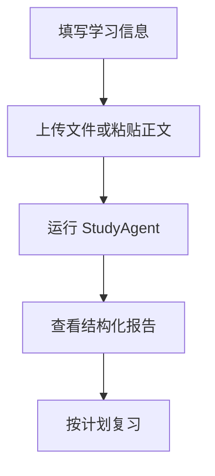

# 考途 StudyAgent PRD

## 1. 文档信息

| 项目 | 内容 |
|---|---|
| 产品名称 | 考途 StudyAgent |
| 英文名称 | StudyAgent |
| 文档版本 | v1.0 |
| 产品形态 | Dify Workflow Web App |
| 项目定位 | 备考教材重点梳理与个性化复习智能体 |
| 当前状态 | 已完成 Dify 原型、DSL 导出、Demo 发布和一次 PDF 测试 |

## 2. 产品背景

备考学生需要处理大量教材、讲义和课程材料。人工整理章节结构、重点笔记、自测题和复习计划成本较高，且不同工具之间缺少连续流程。通用大模型可以辅助总结，但如果缺少固定 Workflow 和输出规范，结果容易泛化、结构不稳定。

## 3. 市场与用户问题

项目早期假设：教材型考试复习仍存在大量“材料输入到复习行动”的转化成本。用户需要的不是单次问答，而是从教材内容到复习任务的连续产出。

核心问题：

1. 教材内容篇幅长，人工整理效率低。
2. 用户难以快速识别章节结构和考试重点。
3. 笔记、练习题和复习计划相互割裂。
4. 通用大模型输出缺乏稳定结构。
5. 用户难以把教材内容转化为可执行的复习任务。

## 4. 产品目标

- 为备考用户生成结构化学习报告。
- 将教材复习任务拆解为稳定的 AI Workflow。
- 提供可导入 Dify 的 DSL，方便复现和迭代。
- 输出可用于求职展示的 PRD、Prompt、测试和迭代文档。

## 5. 非目标范围

当前 MVP 不包含：

- 大规模真实用户增长和运营。
- 自动批改主观题。
- 扫描版 PDF 自动 OCR。
- 真题知识库检索。
- 学习进度账号体系。
- Word 文档自动导出。

## 6. 用户画像

| 用户 | 特征 | 需求 |
|---|---|---|
| 考研学生 | 需要复习专业课教材 | 快速梳理章节重点和背诵笔记 |
| 公务员/事业单位备考者 | 材料多、时间紧 | 把材料转成可执行复习计划 |
| 教资/法考/职业资格备考者 | 需要记忆和刷题 | 生成题目、答案和解析 |
| 大学生 | 期末或课程复习 | 快速整理教材和课堂材料 |

## 7. 核心使用场景

1. 用户上传教材章节 PDF，生成章节结构和重点。
2. 用户粘贴学习材料，生成背诵笔记。
3. 用户希望检验掌握情况，生成自测题和答案解析。
4. 用户填写每日可用时间，生成复习计划。

## 8. 用户故事

- 作为考研学生，我希望上传专业课章节后得到知识框架，这样我能快速理解本章结构。
- 作为备考用户，我希望系统提炼必背和易混淆内容，这样我能优先复习高价值内容。
- 作为学习者，我希望自动生成自测题和答案解析，这样我能检验是否掌握。
- 作为时间有限的用户，我希望得到可执行计划，而不是笼统建议。

## 9. 产品功能架构

```text
输入层：文件上传、考试类型、科目、章节、基础、时间
处理层：文档提取、章节解析、重点提炼、笔记生成、题目生成、答案解析、计划生成
输出层：结构化学习报告
```

## 10. 用户流程



## 11. 功能需求

### 11.1 用户输入

- 用户输入：考试类型、科目、教材文件、章节标题、当前基础、每日时间、复习周期。
- 系统处理：校验关键字段是否缺失。
- 预期输出：可传入后续节点的结构化变量。
- 异常情况：未提供文件或正文时，应提示补充材料。
- 验收标准：测试运行时表单字段完整，变量能被下游节点引用。

### 11.2 章节结构解析

- 用户输入：教材内容、章节标题、学习范围。
- 系统处理：识别章节层级、主题和概念关系。
- 预期输出：章节结构、核心主题、知识模块。
- 异常情况：输入过短或无法定位章节时提示“信息不足”。
- 验收标准：不编造原文不存在的章节。

### 11.3 重点知识提炼

- 用户输入：章节结构和原始材料。
- 系统处理：区分必背、理解、易混淆和考查方式。
- 预期输出：核心重点和优先级。
- 异常情况：缺少材料依据时标注“推断”。
- 验收标准：重点与输入材料相关。

### 11.4 背诵笔记生成

- 用户输入：章节结构和重点。
- 系统处理：转换为可背诵的结构化笔记。
- 预期输出：背诵框架、关键词、答题模板。
- 异常情况：内容冗余时需要压缩。
- 验收标准：语言适合直接复习。

### 11.5 自测题生成

- 用户输入：重点和背诵笔记。
- 系统处理：生成题目，不输出答案。
- 预期输出：题号、题型、题干、难度、考查点。
- 异常情况：重点不足时减少题量并说明原因。
- 验收标准：题目覆盖核心重点。

### 11.6 答案与解析生成

- 用户输入：自测题、重点、原始材料。
- 系统处理：逐题生成答案和解析。
- 预期输出：题号、参考答案、解析、知识点。
- 异常情况：依据不足时标注“依据不足”。
- 验收标准：不得重新生成另一套题目。

### 11.7 个性化复习计划生成

- 用户输入：章节结构、重点、题目、答案、每日时间、复习周期。
- 系统处理：生成可执行计划。
- 预期输出：每日任务、优先级、复盘方式。
- 异常情况：用户时间不足时输出压缩版计划。
- 验收标准：计划符合时间范围且包含看书、背诵、做题、复盘。

## 12. AI 能力需求

- 长文本理解和摘要能力。
- 教材结构识别能力。
- 考试复习场景下的重点提炼能力。
- 题目生成和答案解析能力。
- 计划生成和任务拆解能力。
- 幻觉控制和输出格式稳定能力。

## 13. 输入输出规范

输入至少包含教材文件或章节正文之一。输出固定为六部分：

1. 章节结构
2. 核心重点
3. 背诵笔记
4. 自测题
5. 答案与解析
6. 复习计划

## 14. 异常状态

| 异常 | 处理 |
|---|---|
| 输入过短 | 提示补充教材正文或章节目录 |
| 输入无关 | 拒绝生成并提示正确输入方式 |
| 输入超长 | 建议按章节分段上传 |
| 扫描版 PDF | 建议先 OCR |
| 变量失效 | 在 Dify 中重新选择变量 |
| 模型失败 | 返回清晰错误提示，避免空结果 |

## 15. 产品指标

当前为项目原型阶段，以下为计划评估指标：

- 报告生成完成率
- 章节结构覆盖度
- 重点相关性
- 题目与重点匹配度
- 答案与题目对应率
- 复习计划可执行性
- 用户满意度

## 16. MVP 范围

已完成：

- Dify Workflow 原型。
- Web App 发布。
- DSL 导出。
- PDF 上传测试。
- GitHub 项目文档整理。

待验证：

- 多学科教材表现。
- 扫描 PDF 处理效果。
- 长文本稳定性。
- 用户实际使用反馈。

## 17. 后续迭代规划

- v1.1：完善异常输入处理和输出格式一致性。
- v1.2：补充更多教材测试样例。
- v2.0：增加 OCR 预处理和长文本分段。
- v2.1：接入考试大纲/真题知识库。
- v2.2：支持 Word 导出和错题复盘。

