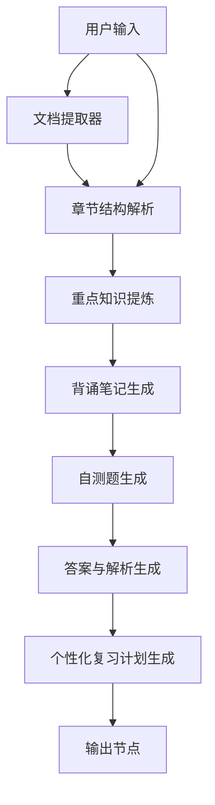

# AI Workflow 设计

## 总览

## 1. 用户输入

- 节点目标：收集学习材料和个性化约束。
- 输入变量：`study_file`、`exam_type`、`subject`、`book_name`、`chapter_title`、`chapter_text`、`current_level`、`daily_time`、`review_period`、`study_scope`、`target_part`。
- 输出变量：用户输入字段。
- Prompt 核心逻辑：无，属于输入节点。
- 依赖关系：作为所有后续节点的信息来源。
- 失败风险：字段缺失、文件无法读取、用户输入无关内容。
- 优化方式：增加必填字段、默认值和异常提示。

## 2. 章节结构解析

- 节点目标：将教材材料解析成章节主题、层级和知识结构。
- 输入变量：文档提取结果、`chapter_text`、`chapter_title`、`study_scope`、`target_part`。
- 输出变量：章节结构解析文本。
- Prompt 核心逻辑：优先基于输入材料，识别层级、主题和概念关系。
- 依赖关系：依赖用户输入和文档提取器。
- 失败风险：扫描版 PDF 提取失败、文本过短、整本书过长。
- 优化方式：增加 OCR 预处理、分段处理和“信息不足”提示。

## 3. 重点知识提炼

- 节点目标：从章节结构和材料中提炼必背、理解、易混淆和可能考查内容。
- 输入变量：章节结构解析结果、教材正文。
- 输出变量：重点知识文本。
- Prompt 核心逻辑：区分不同类型重点，标注依据和推断。
- 依赖关系：依赖章节结构解析。
- 失败风险：模型基于常识过度扩展。
- 优化方式：要求“不得编造输入材料中不存在的事实”。

## 4. 背诵笔记生成

- 节点目标：把重点内容转化为可直接复习的笔记。
- 输入变量：章节结构解析、重点知识。
- 输出变量：背诵笔记文本。
- Prompt 核心逻辑：生成框架、关键词、答题模板和速记版。
- 依赖关系：依赖重点知识提炼。
- 失败风险：内容冗长或变成教材摘抄。
- 优化方式：限制冗余，使用 Markdown 分层输出。

## 5. 自测题生成

- 节点目标：生成题目用于检测掌握情况。
- 输入变量：重点知识、背诵笔记。
- 输出变量：自测题文本。
- Prompt 核心逻辑：只生成题目，不提前输出答案。
- 依赖关系：依赖背诵笔记和重点知识。
- 失败风险：题目与重点不匹配、提前泄露答案。
- 优化方式：固定题目字段：题号、题型、题干、难度、考查点。

## 6. 答案与解析生成

- 节点目标：逐题生成答案、解析和相关知识点。
- 输入变量：自测题、重点知识、原始章节内容。
- 输出变量：答案解析文本。
- Prompt 核心逻辑：严格对应自测题，不重新生成题目。
- 依赖关系：依赖自测题生成。
- 失败风险：重新出题、题号错位、解析无依据。
- 优化方式：强调“不得改变题号，不得重新生成题目”。

## 7. 个性化复习计划生成

- 节点目标：根据用户时间、周期和内容难度生成学习安排。
- 输入变量：章节结构、重点、背诵笔记、自测题、答案解析、`daily_time`、`review_period`、`current_level`。
- 输出变量：复习计划文本。
- Prompt 核心逻辑：综合内容量、难度、用户基础和时间，拆分每日任务。
- 依赖关系：依赖前序所有内容节点。
- 失败风险：计划过满、与时间不匹配。
- 优化方式：增加“时间不足时优先级”和压缩版安排。

## 8. 输出节点

- 节点目标：汇总六类结果。
- 输入变量：前序节点输出。
- 输出变量：最终报告字段。
- Prompt 核心逻辑：无，属于结果映射节点。
- 依赖关系：依赖所有内容节点。
- 失败风险：变量失效、输出字段缺失。
- 优化方式：发布前检查变量有效性，固定输出六个模块。

