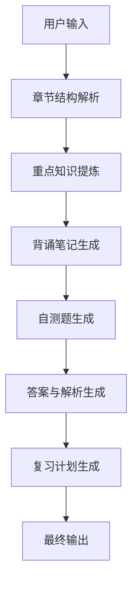

# AI Workflow 设计

## 工作流目标

将教材复习任务拆解为多个连续节点，降低单次大模型生成的复杂度，提高输出稳定性和可解释性。

## 节点链路

## 节点拆分理由

| 节点 | 拆分原因 |
|---|---|
| 章节结构解析 | 先建立内容框架，减少后续节点跑偏 |
| 重点知识提炼 | 将考试相关内容单独处理 |
| 背诵笔记生成 | 面向可背诵表达进行二次加工 |
| 自测题生成 | 只生成题目，避免答案提前泄露 |
| 答案与解析生成 | 保证答案逐题对应 |
| 复习计划生成 | 根据用户时间和基础生成行动计划 |

## 异常处理设计

- 输入过短：提示用户补充教材正文或章节目录。
- 输入无关：拒绝生成学习报告，并提示正确输入方式。
- 输入过长：建议按章节或小节分段上传。
- 模型调用失败：返回明确提示，避免空白结果。

